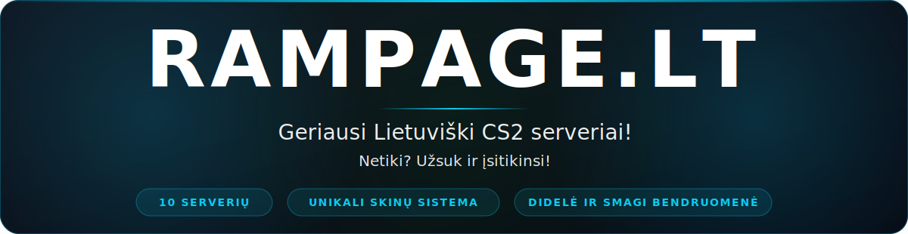
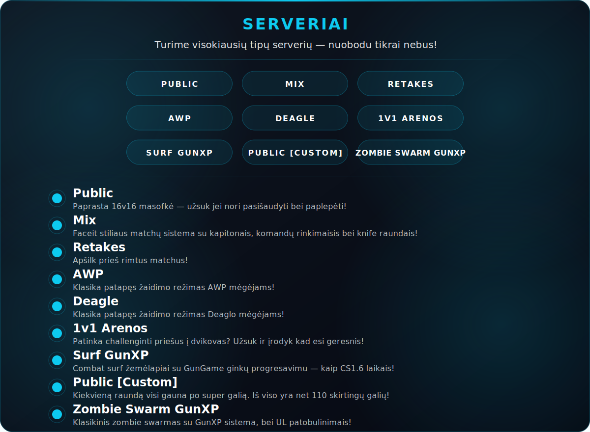
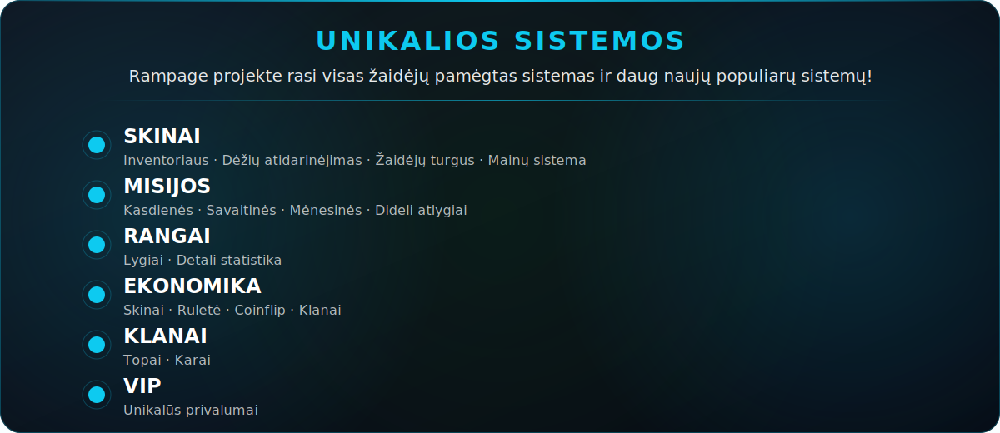

&nbsp;

---

<table align="center">
<tr>
<td width="33%" valign="top">

**Public**  
Paprasta 16v16 masofkė — užsuk jei nori pasišaudyti bei paplepėti!

</td>
<td width="33%" valign="top">

**Mix**  
Faceit stiliaus matchų sistema su kapitonais, komandų rinkimaisis bei knife raundais!

</td>
<td width="33%" valign="top">

**Retakes**  
Apšilk prieš rimtus matchus!

</td>
</tr>
<tr>
<td width="33%" valign="top">

**AWP**  
Klasika patapęs žaidimo režimas AWP mėgėjams!

</td>
<td width="33%" valign="top">

**Deagle**  
Klasika patapęs žaidimo režimas Deaglo mėgėjams!

</td>
<td width="33%" valign="top">

**1v1 Arenos**  
Patinka challenginti priešus į dvikovas? Užsuk ir įrodyk kad esi geresnis!

</td>
</tr>
<tr>
<td width="33%" valign="top">

**Surf GunXP**  
Combat surf žemėlapiai su GunGame ginklų progresavimu — kaip CS1.6 laikais!

</td>
<td width="33%" valign="top">

**Public [Custom]**  
Kiekvieną raundą visi gauna po super galią. Iš viso yra net 110 skirtingų galių!

</td>
<td width="33%" valign="top">

Live statusai ir žaidėjų kiekis realiu laiku:  
**[rampage.lt/serveriai →](https://rampage.lt/serveriai)**

</td>
</tr>
</table>

---

